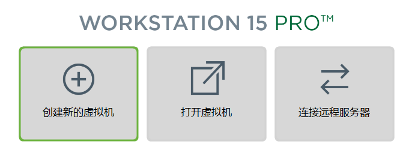

[TOC]
# 我对信息素养实践课程的认识
# &emsp;2020级软件工程3班  李元浩  2020012155
## 课程详情
### 1.常用快捷键
提高学生对电脑的使用效率，帮助对不了解电脑的同学快速上手
### 2.DOS命令
了解可视化操作界面背后的命令运行情况，并初步使用dos命令操作文件
### 3.虚拟机

### 4.[github](https://github.com/)
一款强大的代码托管平台，方便**团队协作**下的大型项目
### 5.Typora
一款应用*markdown*语法的文档书写工具，便于书写***格式工整***的文档
### 6.XMind8
快速制作思维导图的工具，便于日常*书写笔记*和*课后复习*，也可用于工作等方面
## 课程目的
提高同学们对电脑这个工具的整体认识，充分利用电脑来进行专业学习
## 作业补充
### 代码块
```python
for i in range(10):
	print("hello,world")
```
### 代码段
`print("hello,world")`
### 表格
|名称|章节|课时|课件|
|:-|:-:|:-:|:-:|
|第一章|计算机导论|4|无|
|第二章|计算机中的数据|8|无|
|第三章|python|30|无|
|第四章|程序设计基础|8|无|
|第四章|操作系统|16|无|
### 列表（课表）
+ 高等数学
+ 大学英语
+ 计算机导论
+ 信息素养实践
+ 政治课
+ 军事课
+ 心理课
+ 形式与政策